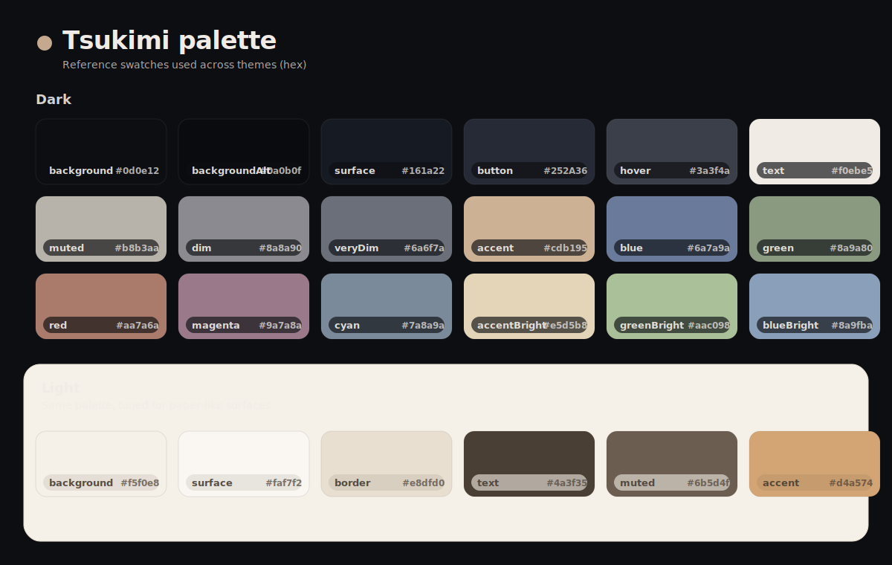

## Layout

- `apps/<app>/tsukimi-dark.*` / `apps/<app>/tsukimi-light.*` (when the app supports separate variants)
- `apps/<app>/tsukimi.*` (when the app uses a combined file)

## Apps

- `kitty` (terminal)
- `zed` (editor)
- `vicinae`
- `dms` (DankMaterialShell)
- `kvantum` (Qt)
- `chrome` (Google Chrome)
- `gtk3.0` (GTK 3)
- `opencode`
- `stylus` (browser extension)
